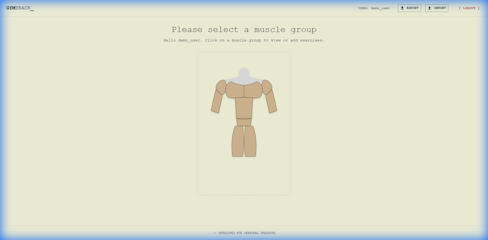
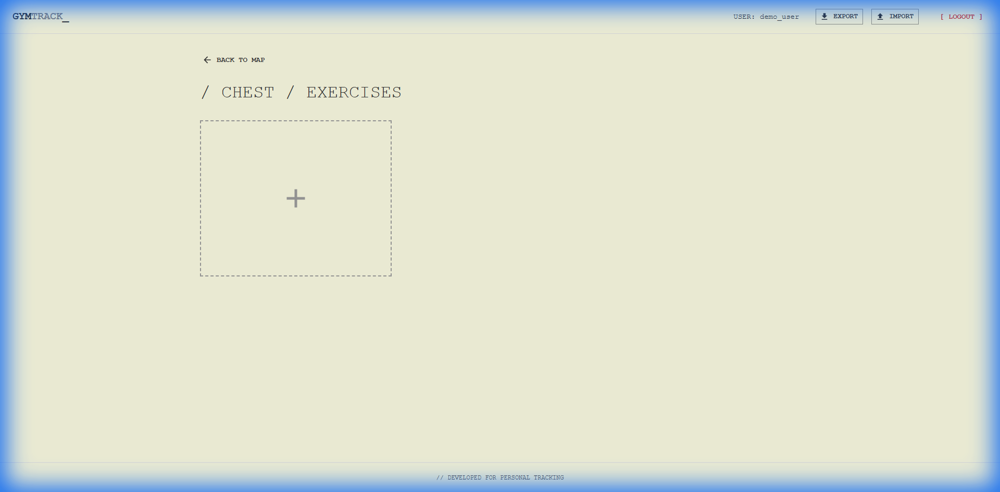
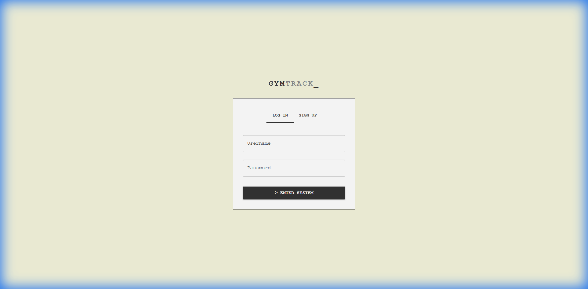

# GymTrack

GymTrack is a fully frontend React application designed for tracking gym performances. It focuses on a clean, developer-centric aesthetic and uses a unique interactive muscle-map interface for navigation.

## Features

- **Interactive Muscle Map**: Hover and click on muscle groups (Chest, Abs, Shoulders, Arms, Legs) to zoom in and manage exercises.
- **Client-Side Persistence**: All data (Auth & Exercises) is stored in `localStorage`, meaning no backend setup is required.
- **Import/Export**: You can download your data as a JSON file and restore it on any device.
- **Developer Aesthetic**: Minimalist design with monospace typography and a clean beige theme.

## Screenshots

### Main Menu (Interactive Map)


### Exercises Page


### Authentication


## Installation & Running

1. **Prerequisites**: Ensure you have [Node.js](https://nodejs.org/) installed.
2. **Install Dependencies**:
   ```bash
   npm install
   ```
3. **Run Development Server**:
   ```bash
   npm run dev
   ```
4. **Build for Production**:
   ```bash
   npm run build
   ```

## Usage Guide

1. **Sign Up**: Create a user (stored locally).
2. **Select Muscle**: Click on a muscle group on the homepage map.
3. **Add Exercise**: Click the large `+` card to add a new exercise with an optional image and stats.
4. **Export Data**: Use the Export button in the top bar to backup your progress.